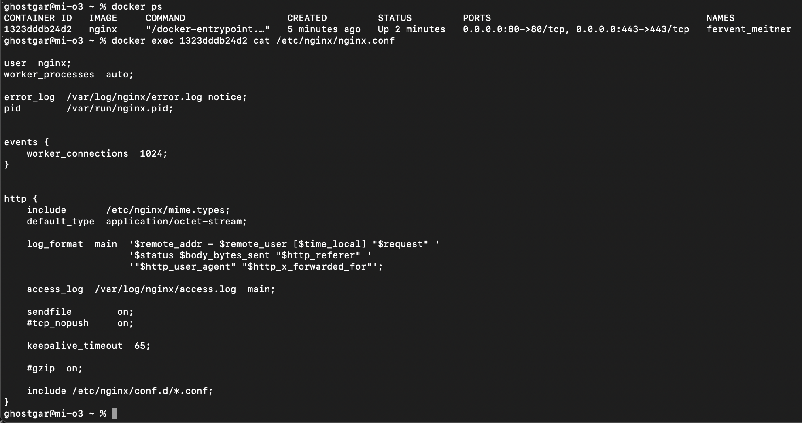

## Part 2. Операции с контейнером

Проверяем что образ запущен и после этого, используя команду `docker exec [container_id] cat /etc/nginx/nginx.conf` читаем конфигурационный файл внутри докер контейнера

Создать на локальной машине файл nginx.conf 
`touch nginx.conf`

Копируем содержимое конфиг файла докер контейнера и дописываем там блок директивы для http сервера по пути /status

> Кроме того, потребовалось закомментить последнюю строку `include /etc/nginx/conf.d/*.conf;` 

Скопировать созданный файл nginx.conf внутрь докер образа через команду docker cp

Перезапустить nginx внутри докер образа через команду exec

Проверить, что по адресу localhost:80/status отдается страничка со статусом сервера nginx. Это мы делаем с помощью команды `curl` либо просто перейдя по ссылке  http://localhost/status

Экспортировать контейнер в файл container.tar через команду export

> Ключ -о позволяет указать имя файла, в который надо сохранить докер-имидж.

Остановить контейнер

Удалить образ через docker rmi [image_id|repository], не удаляя перед этим контейнеры

Удалить остановленный контейнер

Импортировать контейнер обратно через команду import

Запустить импортированный контейнер

Проверить, что по адресу localhost:80/status отдается страничка со статусом сервера nginx

