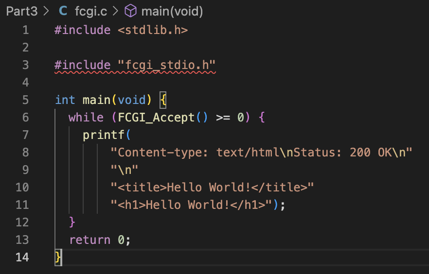
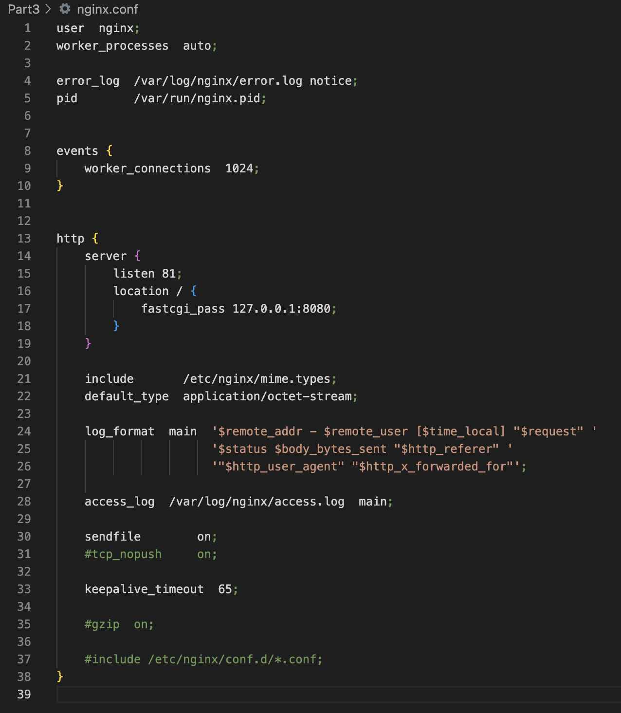
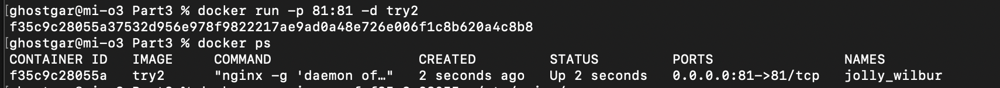
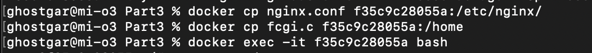
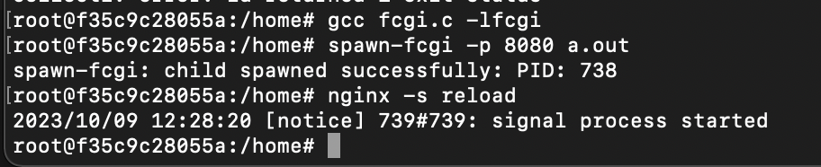
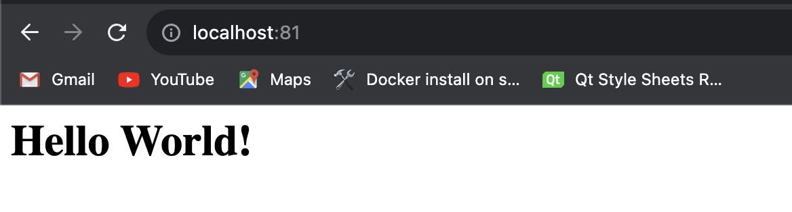
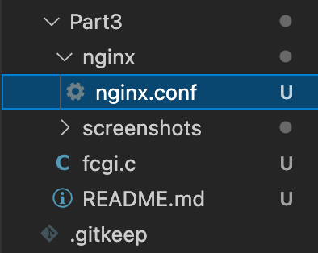

## Part 3. Мини веб-сервер

Написать мини сервер на C и FastCgi, который будет возвращать простейшую страничку с надписью Hello World!

Написать свой nginx.conf, который будет проксировать все запросы с 81 порта на 127.0.0.1:8080

Запустить написанный мини сервер через spawn-fcgi на порту 8080

> Переносим конфиг файл и программу с минисервером в образ. Далее устанавливаем все нужные нам штуки

`apt-get update` 

`apt-get install gcc`

`apt-get install spawn-fcgi`

`apt-get install libfcgi-dev`

После этого, скомпилировав программу *fcgi.c*, запускаем сервер `spawn-fcgi -p 8080 home/a.out` 

Проверяем, что в браузере по localhost:81 отдается написанная нами страничка

Положить файл nginx.conf по пути ./nginx/nginx.conf (это понадобится позже)

