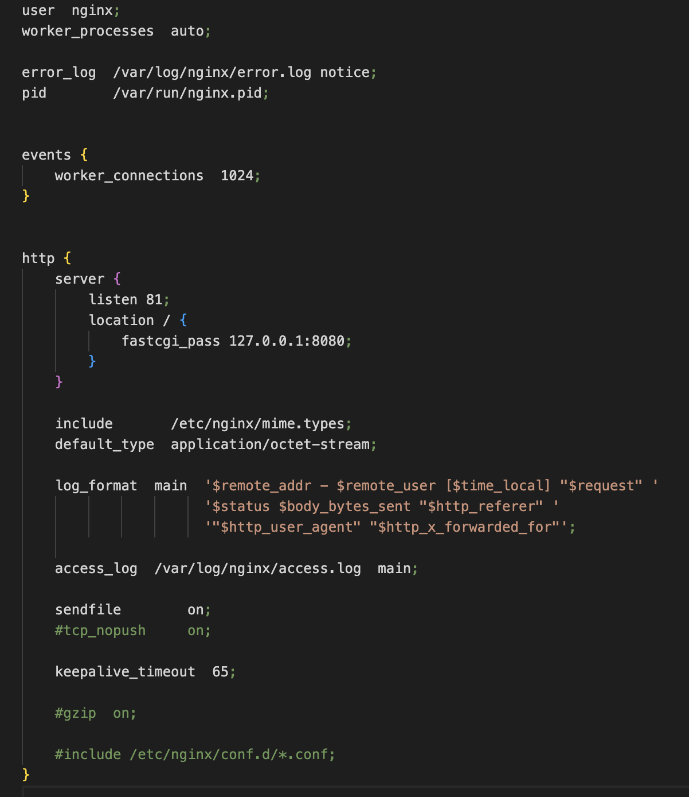
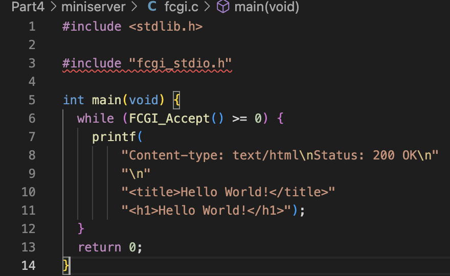
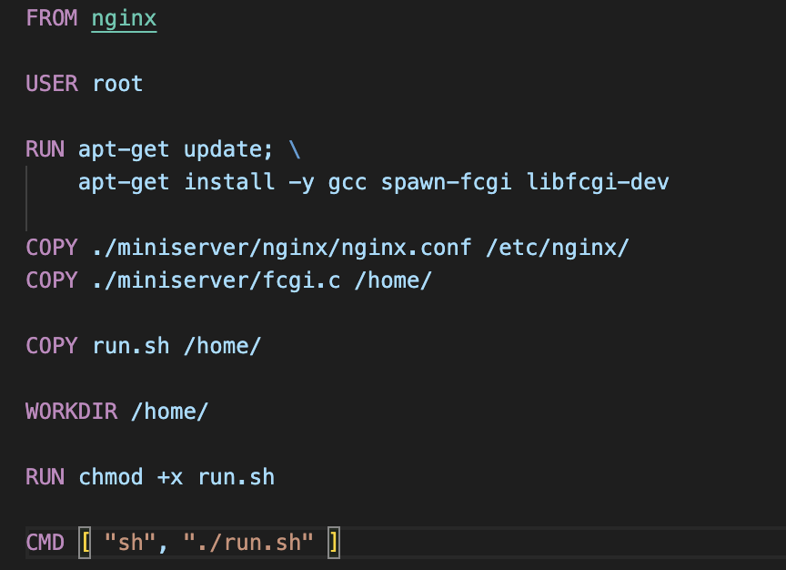
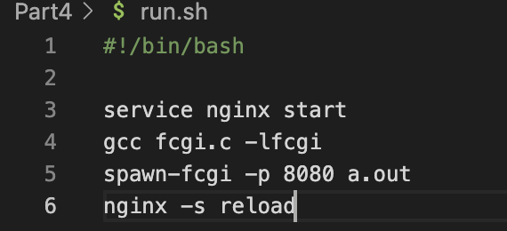
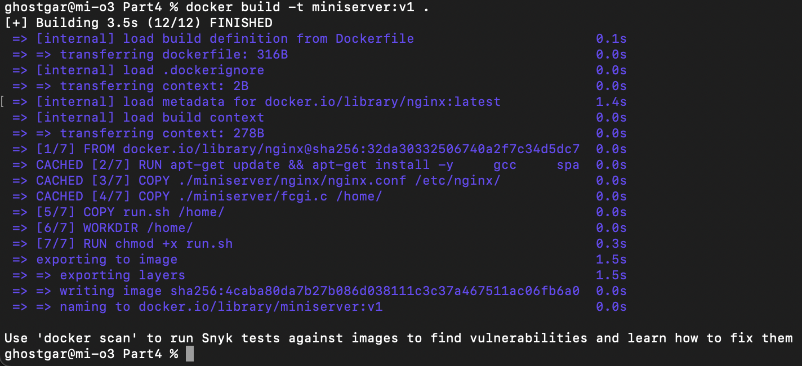
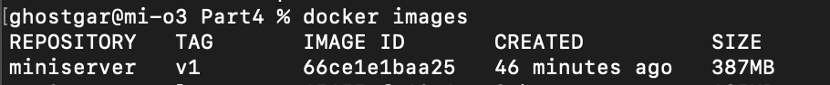
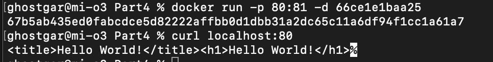
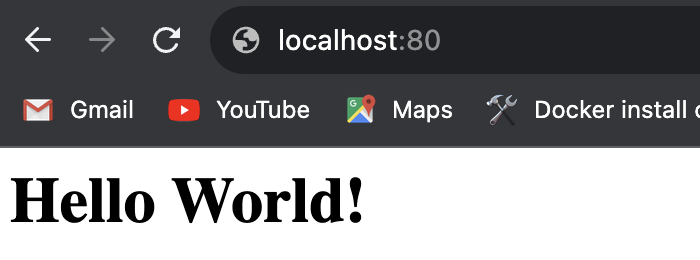
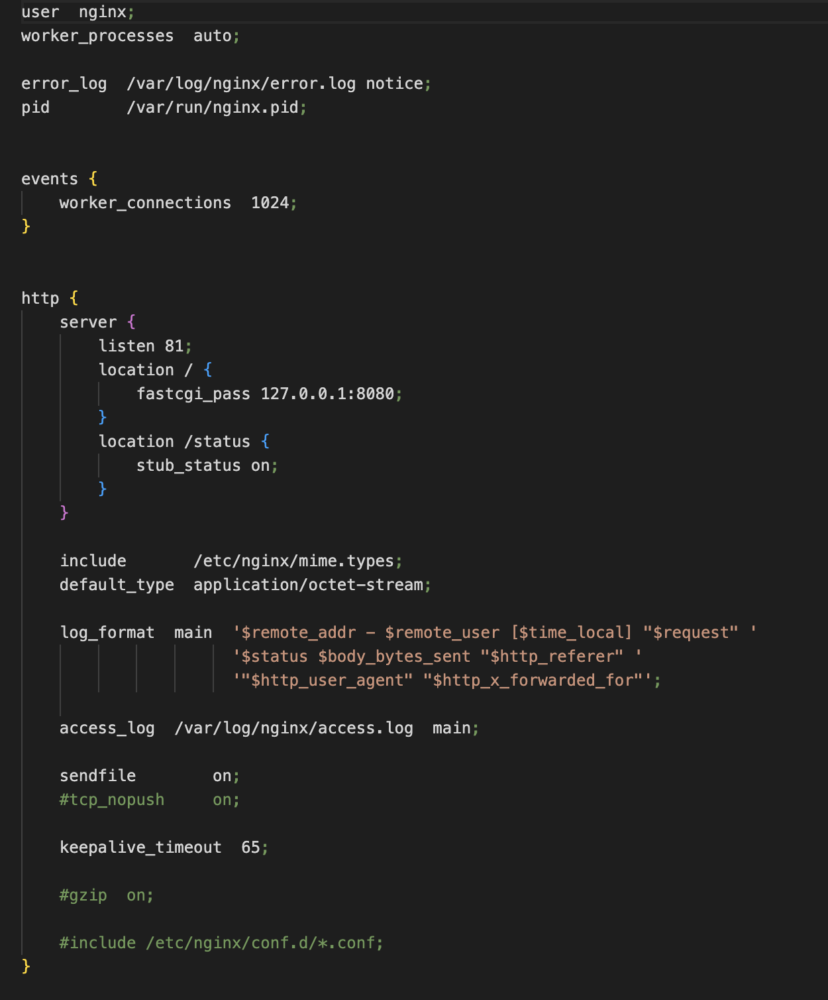
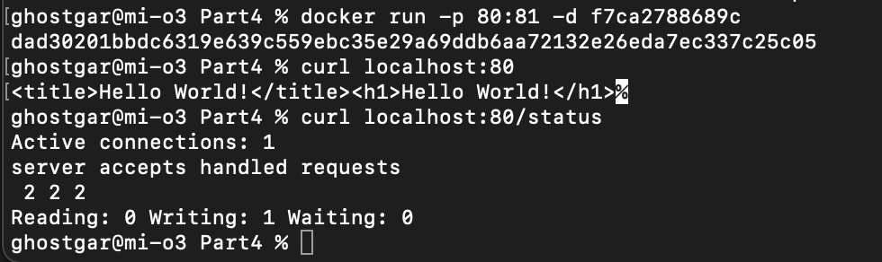

## Part 4. Свой докер

Написать свой докер образ, который:

1) собирает исходники мини сервера на FastCgi из Части 3

2) запускает его на 8080 порту

3) копирует внутрь образа написанный ./nginx/nginx.conf

4) запускает nginx.
nginx можно установить внутрь докера самостоятельно, а можно воспользоваться готовым образом с nginx'ом, как базовым.

За основу возьмем 3 часть задания, для этого скопируем конфиг файл и файл с FCGI в директорию *miniserver*

Далее, напишем Dockerfile и run.sh, все также основываясь на действиях, которые мы проделывали в предыдущей части

После этого все приготовления завершены и теперь с помощью команды `docker build -t miniserver:v1 . ` соберем наш докер образ, при этом указав имя(miniserver) и тег(v1)

Проверяем через `docker images`, что все собралось корректно

Запустить собранный докер образ с маппингом 81 порта на 80 на локальной машине 

Проверить, что по localhost:80 доступна страничка написанного мини сервера

Дописать в ./nginx/nginx.conf проксирование странички /status, по которой надо отдавать статус сервера nginx

Перезапустить докер образ и проверить, что все работает корректно

