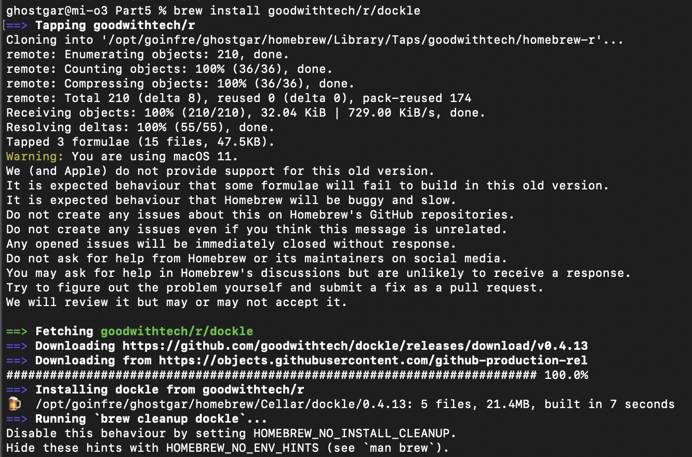
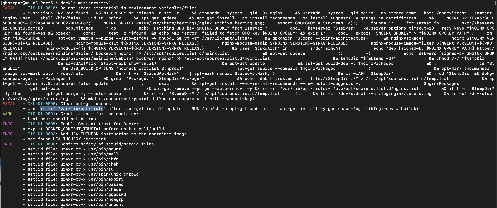
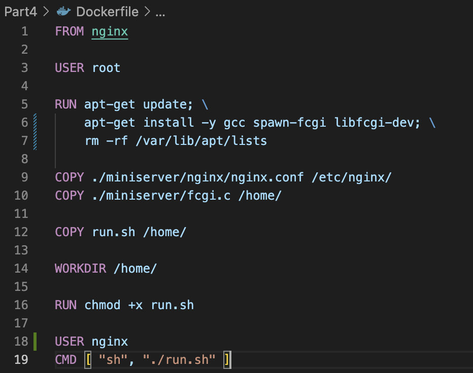
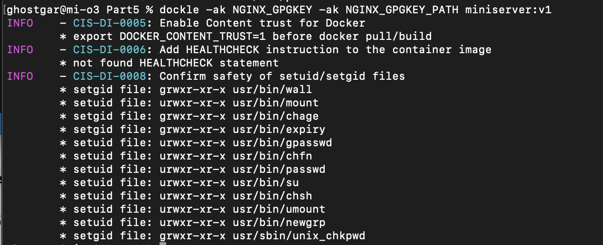
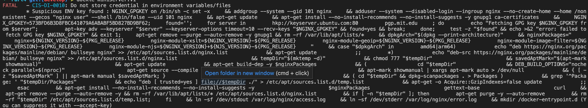

## Part5. Dockle

Перед тем как просканировать образ из предыдущего задания, установим сам dockle через brew с помощью команды `brew install goodwithtech/r/dockle`

После установки запускаем обратно наш докер образ *miniserver:v1* и после этого уже запускаем *dockle*

>Получаем следующие ошибки

Исправляем докер файл, согласно отчету об ошибках

Перезапускаем докер образ и снова проверяем через dockle

> С помощью пиров было выяснено, что данная ошибка устраняется(игнорируется) добавлением флага при вызове dockle: `dockle -ak NGINX_GPGKEY -ak NGINX_GPGKEY_PATH [CONTAINER_NAME:TAG]`